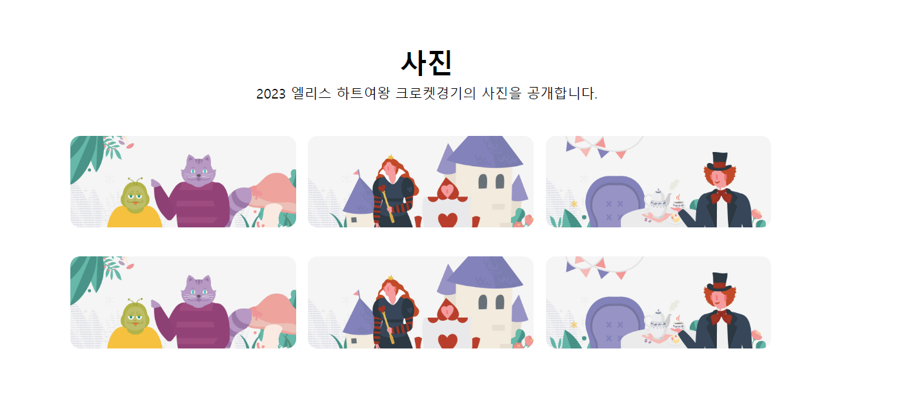
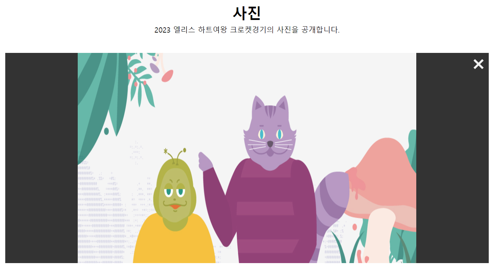

## elice clone

# <h3>🔗 image zoom

: 이미지 클릭시 이미지 줌 창이 나타남.

(클릭 전)


(클릭 후)


```javascript
html
<div class="play-photo">
    
    
    
    
    
    
</div>
<div class="zoom hidden">
    <span class="close">&times;</span>
    
</div>
```

1. 각 이미지에 addEventListener로 click이벤트 추가
2. 클릭한 이미지 파일 이름을 추출

```javascript
파일 이름 = 폴더/파일명.jpg
const arr = click한 이미지.src.split('/');
const src = arr[arr.length - 1]; // 파일명만 추출
```

3. hidden으로 감춰둔 zoom 창의 hidden 속성 없앤다.
   전체 이미지를 보여주는 play-photo(경기 사진을 담은 앨범)에 hidden 속성을 추가해 영역을 잠시 없애고, 없어진 영역에 zoom이 나타나게 한다.

```javascript
js
photoContainer.classList.add('hidden');
zoom.classList.remove('hidden');

css
.hidden {
    display: none;
}
```

4.  줌 할 이미지 소스를 추가하면 된다.

```javascript
const zoom = document.querySelector(".zoom");
const zoom_img = document.querySelector(".zoom_content"); // 줌 창에 담을 이미지 컨텐츠 = 줌 할 이미지

function displayImgZoom() {
    const arr = this.src.split('/');
    const src = arr[arr.length - 1];
    ...
    zoom_img.src = "img/" + src;
}
```

(전체)

```javascript
const zoom = document.querySelector(".zoom");
const zoom_img = document.querySelector(".zoom_content");
const imgs = document.querySelectorAll(".play-photo img");
const photoContainer = document.querySelector(".play-photo");

imgs.forEach((e) => e.addEventListener("click", displayImgZoom));

function displayImgZoom() {
  const arr = this.src.split("/");
  const src = arr[arr.length - 1];
  photoContainer.classList.add("hidden");
  zoom.classList.remove("hidden");
  zoom_img.src = "img/" + src;
}
```

---

# <h3> 🔗 화면 상단의 메뉴 클릭시 해당 콘텐츠를 포함하는 영역으로 스크롤 이동

`window.scrollTo : 화면 스크롤 이동`

```
window.scrollTo(x좌표, y좌표)

기준: 문서의 왼쪽상단
x좌표 : 가로축 , y좌표 : 세로축
window.scrollTo({top, left, behavior})

top : 세로 위치, left: 가로 위치
behavior: 스크롤 효과속성
1. auto - 바로 이동
2. smooth - 부드럽게 이동
```

🔗 좌표는 어떻게?
`offsetTop`, `offsetLeft`

1. 위치를 알아오려는 요소를 구한 뒤,
2. 그 요소의 offsetTop 또는 offsetLeft를 구하면 된다.

```javascript
// 스크롤 이동 함수
function moveTo() {
  // 메뉴의 콘텐츠를 담은 요소 scrollTo
  let scrollTo = document.querySelector(`.${this.id}`);
  window.scrollTo({
    behavior: "smooth",
    top: scrollTo.offsetTop, // 요소의 맨 윗부분 좌표값을 이용해 스크롤 이동
  });
}

// 상단 메뉴 탭
let subTitles = document.querySelectorAll(".sub-title > p");
subTitles.forEach((e) => e.addEventListener("click", moveTo));
```

```javascript
html
메뉴 탭
<div class="sub-title">
    <p id="croket">크로켓</p>
    <p id="player">선수</p>
    <p id="photo">사진</p>
</div>
...

메뉴 컨텐츠 영역
<section class="section-1 croket">...</section>
<section class="section-2 player">...</section>
...
```
